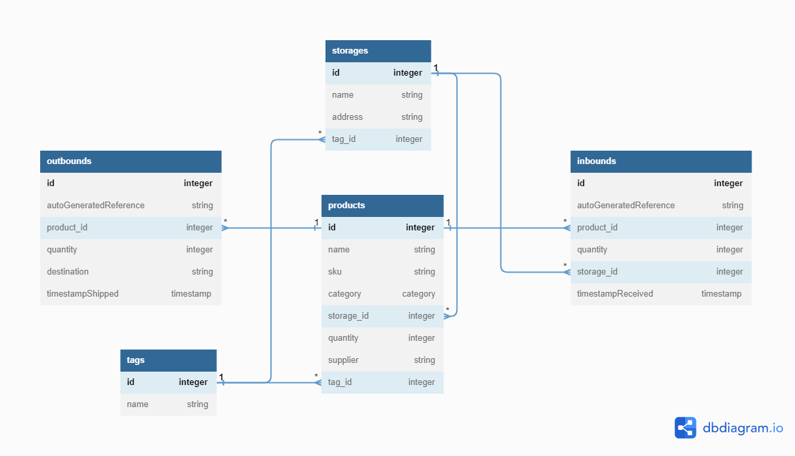

# About the API

This is an API for inventory management. This project utilizes Spring Framework with Spring Booot, H2 lightweight database, and Gradle to build. The API follows RESTful principle, it heavily emphasizes on HATEOAS constraint, every resources returned to the client is packed with URI pointing to all related entities of the object, for example, requesting a GET on product by its Id will return the product itself + the related resource links to its products collection, storage URI, tag URI, etc. In this way, statelesness and client-server decoupling is maintained, thus, becomes closer towards being RESTful. Of course, statelessness and client-server decoupling is not the only principles we need to adhere to become RESTful, more on  [REST API](https://www.ibm.com/topics/rest-apis).

# API Documentation
API documentation is [here](https://documenter.getpostman.com/view/26886657/2s93XyVj1m). It includes examples of all endpoints usage and their expected response.

# Database Design
<p>Below is the schema for the database, more columns are coming soon such as outbound/inbound transaction status, etc.</p>

     
<p>DB Schema</p>

# Hosting on Windows

To run this API on Windows, you'll need to have the following prerequisites installed:

- Java 19
- Git (optional)
- the project source code

Once you have these prerequisites, follow these steps to run your project:

1. Open a command prompt window and navigate to the root directory of your project.

2. Check that **Gradle wrapper** script called "**gradlew**" in the project directory. If not, you'll need to install [Gradle](https://gradle.org/install/) and generate a wrapper script by running the following command:
```
    gradle wrapper
```

3. Once you have the "gradlew" script in your project directory, you can use it to run your project by running the following command:
```
    ./gradlew bootRun
```

4. If you encounter any issues, you can try cleaning your project and rebuilding it and rerun it again by running the following commands:
```
    ./gradlew clean build
```
```
    ./gradlew bootRun
```

5. Thats's it, good luck!

